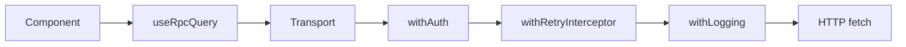

# @sunbeam/g2v

Frontend library for the Sunbeam Service Framework. Provides the same five-layer
architecture (UI / state / data / routing / observability) for React 19 apps that
the Rust crate provides for axum services.

The name is the Sun's spectral classification (G2V — main-sequence yellow dwarf),
not a backronym.

## Runtimes

| Runtime    | Status                                                              |
| ---------- | ------------------------------------------------------------------- |
| Browsers   | Full — every entrypoint, including `/otel`.                         |
| Deno       | Compatible for everything except `/otel` (browser-only OTel SDKs).  |
| Node.js    | Same as Deno — fine for SSR if `otel` is omitted from the provider. |
| Bun        | Same as Deno.                                                       |

`/otel` pulls in `@opentelemetry/sdk-trace-web` and the browser
auto-instrumentations (fetch / XHR / user-interaction), which require `window`
and `XMLHttpRequest`. Outside the browser, skip that entrypoint and don't pass
an `otel` prop to `FrameworkProvider`.

## Layers

| Layer          | Tech                                       | Maps to (`sunbeam-g2v` Rust) |
| -------------- | ------------------------------------------ | ----------------------------- |
| UI             | `beam-ui`                                  | n/a (caller-owned)            |
| State          | `legend-state`                             | n/a                           |
| Data           | `@connectrpc/connect-web` + TanStack Query | `client/factory`, `service`   |
| Routing        | `@tanstack/react-router`                   | `router`                      |
| Observability  | `@opentelemetry/sdk-trace-web`             | `middleware/instrumentation`  |

Feature parity with the Rust crate is **client-side only** — `db`, `mq`, and
`election` are server concerns and are not ported.

## Subpath exports

```ts
import { FrameworkProvider } from "@sunbeam/g2v/providers";
import { useRpcQuery, useRpcMutation } from "@sunbeam/g2v/hooks";
import { ServiceError, createTransport } from "@sunbeam/g2v/core";
import { authStore, authActions } from "@sunbeam/g2v/state";
import { withAuth, withRequestId, withRetryInterceptor } from "@sunbeam/g2v/interceptors";
import { setupOtel } from "@sunbeam/g2v/otel";
import { createMockTransport } from "@sunbeam/g2v/testing";
```

## Quick start

```bash
deno add @sunbeam/g2v
```

```tsx
import { StrictMode } from "react";
import { createRoot } from "react-dom/client";
import { createTransport, FrameworkProvider } from "@sunbeam/g2v";
import { setupOtel } from "@sunbeam/g2v/otel";

setupOtel({ serviceName: "my-app", otlpUrl: "/v1/traces" });

const transport = createTransport({ baseUrl: "/api" });

createRoot(document.getElementById("root")!).render(
  <StrictMode>
    <FrameworkProvider transport={transport}>
      <App />
    </FrameworkProvider>
  </StrictMode>
);
```

## Data Flow



## Tasks

```bash
deno task test   # Run tests
deno task lint   # Lint
deno task check  # Type check
```

## Examples

See [`examples/simple/`](examples/simple/) for a full ConnectRPC end-to-end demo.

## License

MIT
